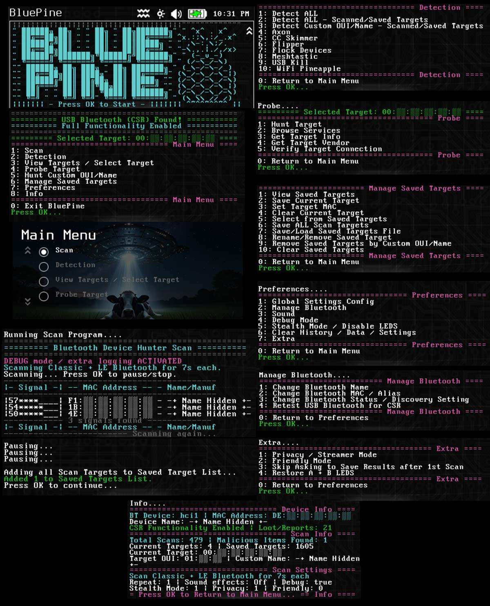
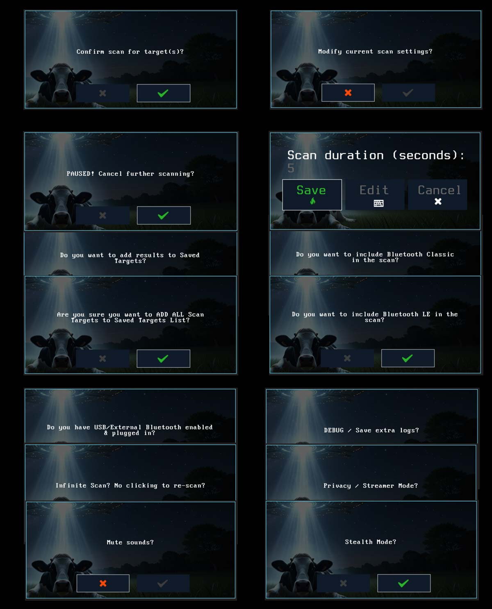
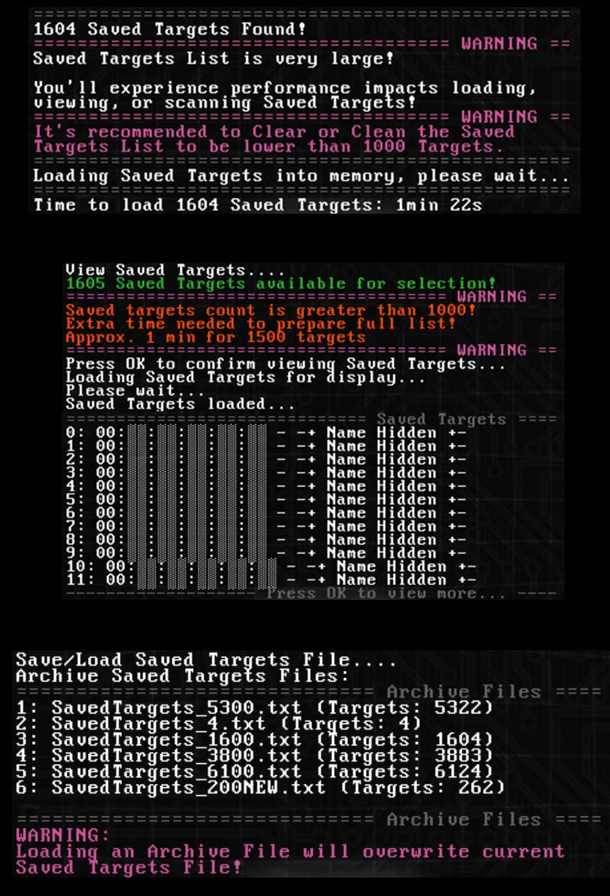

To install/run, copy the "bt-bluepine" folder with "include" subfolder to the folder of your choice on the pager in "/mmc/root/payloads/user/" and run "BluePine".

Ex. "/mmc/root/payloads/user/reconnaissance/bt-bluepine" would put "BluePine" under the "Reconnaissance" menu.

On first run it will run through an automated install for dependency "evtest" which monitors the pagers input buttons for pausing/stopping infinite scans, and "GNU grep" for more efficient pattern matching.  After dependencies are checked/installed, ringtones will be verified and copied if they do not exist.  When dependencies and ringtones are met, you will reach the BluePine menu and these items will be checked silently each start of the app without being prompted again.

Each time the app starts, it will prompt you asking about a USB Bluetooth Adapter to select which Bluetooth interface to use for scanning.  Using a USB CSR8510 / CSR v4.0 Bluetooth Adapter instead of the Pagers internal Bluetooth provides better range and ability to change MAC address.

MAC details and device names are hidden in the images below due to "Privacy Mode" being enabled. Privacy Mode allows you to hide major details on the pager screen/display while keeping full functionality.  Privacy mode is disabled by default and can be enabled in Preferences -> Extra.

# Menus/Scanning

# Custom OUI/Name Search

# Prompts/Configuration

# Saved Target Loading + Save/Load File

# Changing List Picker Font Size
The default font size for the list picker is set at medium as seen below (on the right):

BluePines menus look best if the list picker font size is small.  [Please use this tool](https://github.com/cncartistsec/WiFi-Pineapple-Pager-Payloads/tree/main/theme-cfg-list-font) which changes files relating to the list picker font size to be smaller, can return back to default.  Theme needs to be reloaded after changing to apply.

# Title: BluePine
# Author: cncartist
# Description: Bluepine - Bluetooth Device Detection & Hunting Suite. Detection Scanner, Target Probing, Last Target and Saved Targets List Management, Save / Load Saved Target List from File, Configuration Saving, Debugging, Privacy, Stealth, and more.  Full functionality tested on Pagers internal Bluetooth & USB CSR8510 / CSR v4.0 Bluetooth Adapter.  Without a USB CSR v4.0 Bluetooth Adapter there will be a slightly limited experience due to less signal/range and inability to change the built in MAC.
# Category: reconnaissance
# Version: 1.0
# 
# ============================================
# Acknowledgements: 
# ============================================
# Find Hackers - Author: NULLFaceNoCase - (idea and concept for searching BT devices)
# Incident Response Forensic Collector - Author: curtthecoder - (logging example)
# Zombie UFO Theme - Author: Zombie Joe - (theme support & testing)
# toggle_ab_leds - https://github.com/jader242 - (stealth mode inspiration)
# https://www.rapidtables.com/code/text/ascii-table.html - (acsii verification for logo)
# https://github.com/judcrandall/lookout.py/tree/main - (Axon OUI)
# Fuzz_Finder - Author: OSINTI4L - (Axon OUIs)
# https://github.com/aat440hz/CardSkimmerDetector-M5AtomS3LITE/tree/main - (CC Skimmer Data)
# https://github.com/colonelpanichacks/flock-you/tree/main - (Flock OUIs + Names)
# 
# ============================================
# Includes: 
# ============================================
#  -- Bluetooth Device Hunter (Classic + LE combined or separate).
#  -- -- -- Hunt via Scanning All, Single MAC, OUI prefix, and/or Name.
#  -- -- -- RSSI meter for each found signal, best signal showing at the bottom of the screen.
#  -- -- -- Custom configuration allowed and data builds over time in case name or manufacturer is missed on first scans.
#  -- -- -- Verbose logging / debugging available.
#  -- Axon / CC Skimmer / Flipper / Flock / Meshtastic / USB Kill / WiFi Pineapple BT Scanner.
#  -- -- -- Scan the airwaves, save targets, or scan your already saved target list from Device Hunter scans.
#  -- Target Probing:
#  -- -- -- Required to set a Target before accessing the Probe menu.
#  -- -- -- Set Target MAC, Hunt Target, Browse Services, Get Target Info, Get Target Vendor, Verify Target Connection.
#  -- -- -- All probe actions are passive with the exception of Verify Connection which will test connection but not send data/commands.
#  -- -- -- No activity/probing will happen on the target MAC until confirmed by the user flow.
#  -- -- -- When testing, it's normal for a secure device not accepting general connection/pairing requests to not respond to any of the Probing features.
#  -- -- -- In this suite, Get Target Vendor would be the only valid tool to lookup data related to a device MAC that's secured.
#  -- -- -- Custom OUI input needs to be a full MAC to pass the mac validator.
#  -- -- -- The last 3 octets will be removed keeping only the Custom OUI when entered.
#  -- Bluetooth Discoverable Setting Changer + Bluetooth Hardware Name Changer.
#  -- -- -- Can change both USB + Internal Settings.
#  -- Bluetooth MAC Address Changer for USB CSR8510 / CSR v4.0 Bluetooth Adapter.
#  -- -- -- Bluetooth MAC Address Changer will act on hci1 by default and has been tested to work on various CSR8510 Bluetooth Adapters (range from $5-10).  Can also permanently change Alias/Name for specific MAC as an option, or restore the old name before change.  Boot the pager first before plugging in USB BT Adapter to ensure it gets hci1 instead of hci0.
#  -- Last Target and Saved Targets list management.
#  -- -- -- Saved Targets list can be built over time, recommended to keep under a certain number and a warning will show when loading the payload with saved targets greater than the warn number.
#  -- -- -- You'll experience performance impacts loading the payload, viewing, or scanning Targets if the list is over the warn number.  It's been tested to over 6000 random MACs + Names without any crashes but takes minutes to load the list for display.
#  -- -- -- When adding Scan Targets to the Saved Target List, it will only report a new addition if the mac did not exist in the list prior.
#  -- -- -- All Scanned MACs/Names are stored in "Targets List", these are cleared automatically & lost when the payload is closed.
#  -- -- -- Saved MACs/Names that persist across app openings are stored in "Saved Targets List".
#  -- -- -- You can add Scanned Targets to the "Saved Targets List" directly after a scan, or in the "Manage Saved Targets" menu option.
#  -- Save / Load Saved Target List from file
#  -- -- -- Saved Target List can be named for archiving, alphanumerical characters only.
#  -- Configuration saving / tracking number of scans and malicious items found over time.
#  -- Privacy / Streamer Mode:
#  -- -- -- (obscures MAC + Targets/Device Names) allows full functionality while obscuring ALL identifying information on screen, for both targets and self.
#  -- Friendly Mode:
#  -- -- -- Changes verbiage based on status, "target" -> "device", "hunt" -> "find"
#  -- Stealth Mode:
#  -- -- -- Sound Effects, LEDS, Payload LED Actions Disabled
#  -- Debug Mode:
#  -- -- -- A notification will show before each scan with debug enabled and extra log files saved for that process.
#  -- -- -- Saves full data stream for each Bluetooth scan at multiple points.  Please be aware these files can add up over time and it's best to clear them out or turn off debugging mode if not actively using them for debugging.
#  -- Dependencies / Ringtones:
#  -- -- -- evtest and GNU Grep are required dependencies, will install automatically if confirmed
#  -- -- -- Will check for ringtones at start and copy if confirmed
# 
# ============================================
# Notes:
# ============================================
#  -- Device Hunter Scan: 
#  -- -- -- Long Press or Tap OK on Pager to pause/stop scanning (not tested with virtual pager buttons yet)
#  -- -- -- -- - Required when infinite scan is enabled (default)
#  -- -- -- -- - The pause/stop action is recorded but cannot be paused/stopped while BT scanning.
#  -- -- -- -- - It may take a couple seconds to process the pause/stop command.
#  -- -- -- -- - If you do not stop/finish the scan, targets are not saved and you are only viewing the scan details on the screen.
#  -- -- -- -- - It may pause instantly to as little as a few seconds, or the total time of "scanning/BLUE LED blinking" to pause/stop.
#  -- -- -- -- - This is to prevent stopping the actual bluetooth scans.
#  -- -- -- -- - Check for pause/stop is only done at certain points in the scanning process.
#  -- -- -- -- - You are able to pause, then continue scanning, or stop and add targets and/or return to main menu.
#  -- -- -- -- - Targets are not permanently saved until confirming to save them to Saved Targets.
#  -- -- -- -- - Best time to press pause/stop is after the final processing step/RED LED solid, before results are shown/MAGENTA LED solid.
#  -- -- -- Before each Scan, you can choose default/unchanged Scan settings, or Modify Scan settings.
#  -- -- -- -- - Pre-Scan Modify allows changing Scan duration and Scanning Classic + LE combined or separate.
#  -- -- -- -- - You would only choose one type if you knew which one has the BT device(s) you're searching for.
#  -- -- -- If locating a specific item, sometimes it's best to get multiple scans in close proximity to confirm the strength is accurate.
#  -- -- -- The best way to get used to the sensitivity is to scan for known devices and locate them within close range to see the sensitivity received.
#  -- -- -- There are many factors in Bluetooth sensitivity; walls & windows bounce or weaken signal, desks/objects can weaken signal, orientation of the pager can matter, and signals can look weak until you get closer to the actual source/Bluetooth chip on the target device. 
#  -- -- -- Using an external USB CSR8510 / CSR v4.0 Bluetooth Adapter, you can achieve better sensitivity and range.
#  -- Bluetooth: 
#  -- -- -- If you boot up the pager with USB bluetooth plugged in, it may reverse the hci addressing.
#  -- -- -- -- - Please boot the pager WITHOUT a USB device connected for hci0 to be addressed as the first default device.
#  -- -- -- How to verify your USB CSR8510 / CSR v4.0 Bluetooth Adapter is GENUINE
#  -- -- -- -- - Run: hciconfig hci1 -a
#  -- -- -- -- - Verify line output of -> HCI Version + LMP Version + Manufacturer
#  -- -- -- -- - Both GENUINE + FAKE/BAD Versions: # Manufacturer: Cambridge Silicon Radio (10)
#  -- -- -- -- - GENUINE: # HCI Version: 4.0 (0x6)  Revision: 0x22bb
#  -- -- -- -- - GENUINE: # LMP Version: 4.0 (0x6)  Subversion: 0x22bb
#  -- -- -- -- - FAKE/BAD: # HCI Version:  (0xe)  Revision: 0x201
#  -- -- -- -- - FAKE/BAD: # LMP Version:  (0xe)  Subversion: 0x201
#  -- -- -- -- - If you have no "Version: 4.0" in your details, the adapter will not work efficiently and is not a genuine CSR v4.0.
#  -- Debug / Logging:
#  -- -- -- With debug enabled, log files will add up quickly over time in filesize.
#  -- -- -- -- - Please take care to only debug when needed; it keeps full BT scan LOG files which take significant space.
#  -- Menu Display / Smaller Font Size for List Picker:
#  -- -- -- changed text_size to small and max_chars to 38/40
#  -- -- -- "text_size": "small"  &  "max_chars": 38  &  "max_chars": 40
#  -- -- -- updated theme in /mmc/root/themes/THEME/components/templates
#  -- -- -- -- - option_dialog_string.json  ( "max_chars": 38 )
#  -- -- -- -- - option_dialog_string_selected.json  ( "max_chars": 40 )
# 
# ============================================
#             SCAN LED STATUS
# ============================================
#             ------ start ------
# GREEN:            Configuration
# MAGENTA:          IDLE
#             ------ scanning ------
# WHITE:            Resetting adapter
# BLUE SLOW blink:  Scanning Bluetooth Classic
# CYAN SLOW blink:  Scanning Bluetooth LE
# WHITE:            Finished scans
# BLUE:             Cleanup / pre-processing
# GREEN:            Build result file for processing
# YELLOW:           String manipulation of result file
# RED:              Final looping results for display
# MAGENTA:          Finished processing
#             ------ scanning ------
# ============================================
#             RINGTONEs used
# ============================================
# flutter       PAYLOAD LOADED
# glitchHack    SCAN READY
# Achievement   SCAN FOUND ITEMS
# sideBeam      SCAN FOUND NONE
# warning       DETECT FOUND ITEMS
# ScaleTrill    DETECT FOUND NONE
# ============================================
#          Future improvements
# ============================================
# gps data tagging for scans?
# text switch for how many targets found in session or detected
# build log viewer in?
# change actual sound setting for system/alerts?
# implement sql lite db instead of current method?
# ============================================
